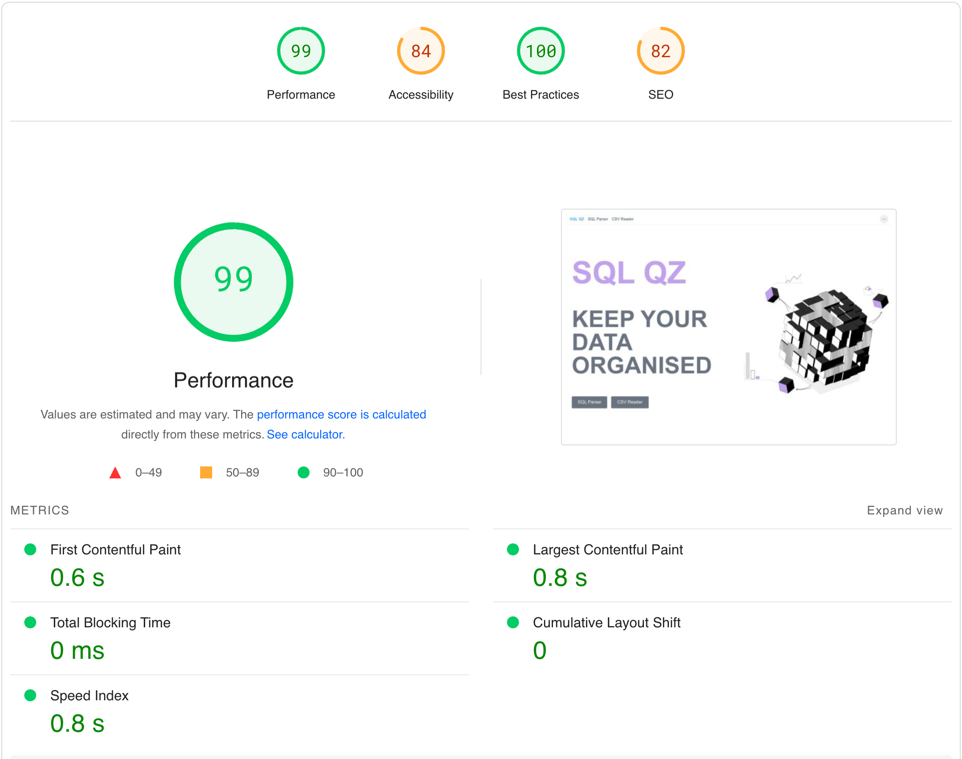
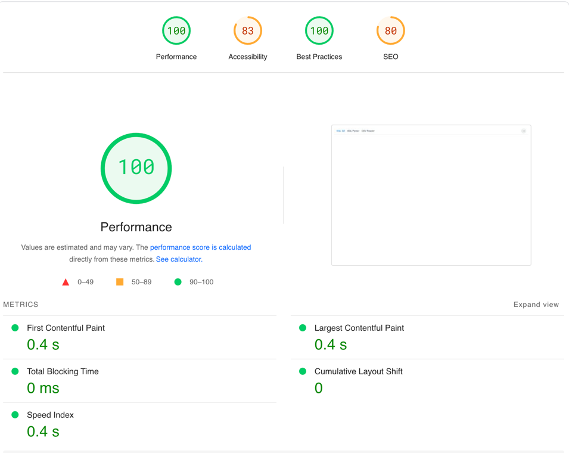
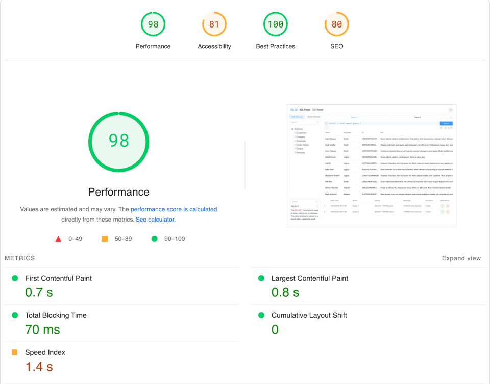

# SQL QZ

## Overview

URL:
[https://sql-qz.vercel.app/](https://sql-qz.vercel.app/)

This application is a powerful tool designed for data analysis tasks, offering a streamlined and efficient user experience. With features such as CSV reader, SQL Parser along with utilizing technologies like web workers, virtual scrolling, lazy loading etc allow for seamless handling of large files and thus analysts can effortlessly manage their data. This app is responsive for different screen sizes, it supports small laptops as well as bug monitors. This has support for VAPT as well as there are tooltips for every icon, alt for images, html structure for SEO etc.

## Product Walkthrough

https://youtu.be/L4OQwxhXzcM

## Screens


## Features

### SQL Parser

- **Advanced SQL Editor:** Includes features such as code completion and syntax highlighting, providing users with a powerful environment for writing and editing SQL queries.

- **Virtual Scroll:** Utilizes virtual scroll functionality for the resultant table, ensuring smooth performance even with large datasets without browser lag.

- **Query Management:** Offers options to copy queries, save queries for future use, and view query history, enhancing productivity and workflow efficiency for analysts.

- **Tab Layout:** Allows users to persist multiple searches concurrently through a tab layout, supporting up to 10 concurrent tabs for managing various queries and analyses.

- **Information Section:** Provides a query assistance section where users can type keywords to access relevant information, improving the overall user experience and query efficiency.

- **Table Structure View:** Includes a table structure view for quick reference, allowing users to see all schemas, tables, and columns to aid in query writing and analysis.

- **Query History Section:** Includes a query history section where users can view, edit, and execute previous queries, providing a convenient way to manage and reuse queries.


### CSV Reader

- **Seamless Handling of Large Files**: Utilizes **web workers** for efficient computation, ensuring smooth performance even with very large CSV files. Works smoothly with test data consisting of 1 million rows plus rows.

- **Search Capability**: Employs web workers for column-specific search functionality, allowing users to quickly locate information without browser lag.

- **Multiple Upload Methods**: Supports traditional file upload and drag-and-drop functionality, providing flexibility for users to upload CSV files in their preferred manner.

- **User-Friendly Interface**: Offers an intuitive and easy-to-use interface for uploading and managing CSV files, enhancing the overall user experience.

- **Performance Optimization**: Implements optimization techniques to ensure fast and responsive performance, enabling users to work with CSV files efficiently and effectively.

- **Background Record Counting**: Utilizes web workers to count the number of records in the CSV file in the background, providing users with real-time feedback on the size of the dataset they are dealing with.

### In Development Features

- **Product Walkthrough:** Introduces a guided walkthrough feature to familiarize users with the application's functionality and interface, enhancing usability for new users.

- **Export Functionality:** Enables users to export query results in CSV, Excel, or PDF formats, providing flexibility for data sharing and analysis.

- **Integration with Open API:** Introduces integration with an open API to provide users with relevant information based on keyword searches, enhancing the application's query assistance capabilities.

- **Table Structure Enhancements:** Enhances the table structure feature by adding additional functionalities or improvements based on user feedback, such as advanced search options or interactive visualization tools.

### Project Structure

This Vue.js + Vite application follows a structured organization to maintain clarity and scalability. Below is an overview of the project structure along with the technologies and npm packages used:

## Technologies Used

- **Vue3:** Used Vue 3 along with composition api.
- **Vite:** A next-generation frontend tooling for fast development and building.
- **Element Plus:** A Vue.js UI library for building flexible and customizable components.
- **Pinia:** A state management library for Vue.js applications.
- **Vue Router:** The official router for Vue.js applications.
- **TypeScript:** A typed superset of JavaScript that compiles to plain JavaScript.
- **Tailwindcss**: Utility-first CSS framework.

## npm Packages

- **@element-plus/icons-vue:** Icons library for Element Plus UI framework.
- **element-plus:** Vue.js UI library for building flexible and customizable components.
- **vue-codemirror:** Code editor component for Vue.js applications.
- **vue-uuid**: Utility for generating UUIDs in Vue.js applications.
- **papaparse**: CSV parsing library for JavaScript.
- **@codemirror/lang-sql**: CodeMirror language mode for SQL.
- **@vueuse/core**: Collection of essential Vue Composition API utils for Vue 3.
- **vue-tsc**: Vue.js type checker.


### Code Optimisation Techniques Used

- **Minification:** Minimizing the size of JavaScript, CSS, and HTML files by removing unnecessary characters like whitespace and comments. For this vite-plugin-compression package has been used with brotli as compression algorithm.

- **Tree Shaking:** Eliminating unused code or dead code from the application's bundle. This helps reduce the size of the bundle by removing redundant code, resulting in faster load times.Vite has inbuilt support for this.

- **Code Splitting or Dynamic Imports:** Dividing the application's codebase into smaller chunks that are loaded dynamically as needed. By using dynamic imports instead of regular imports we have achieved this.

- **Lazy Loading:** Delaying the loading of non-critical resources such as images, scripts, or styles until they are needed. Virtual scroll is based on this concept. Divs in table are created only for the viewport and as user scrolls, new divs are created and old ones are destroyed.

- **Compression of png files:** Online tools used for compressing png files before using them.

- **Web Workers:** Utilizing web workers for computationally intensive tasks, such as parsing large CSV files and converting it to json or performing search on large data, to ensure smooth performance and responsiveness.

### Page load times using Page Speed Insights



  

## Project Setup

```sh
npm install
```

### Compile and Hot-Reload for Development

```sh
npm run dev
```

### Type-Check, Compile and Minify for Production

```sh
npm run build
```

### Lint with [ESLint](https://eslint.org/)

```sh
npm run lint
```
